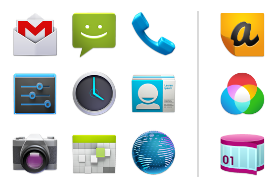
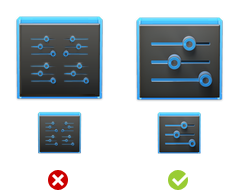
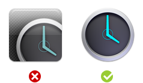
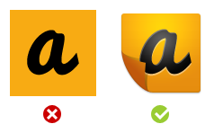

# 启动器图标

>已经有新版针对应用设计师的指南！  
>可在 **[Android 设计](https://developer.android.com/design/index.html)**中查看最新的文档，包括更多关于[图标](https://developer.android.com/design/style/iconography.html)的指导原则。

启动器图标代表着你的应用的图像。启动器图标是启动器应用使用的出现在用户主屏幕上的。启动器图标也可以用来表示进入你应用的快捷方式（例如，联系人快捷图标可以用来打开一个联系人的细节信息）。

如[提供特定密度图标集合](https://developer.android.com/guide/practices/ui_guidelines/icon_design.html#icon-sets)和[多屏幕支持](https://developer.android.com/guide/practices/screens_support.html)中所述，你应当为所有广义屏幕密度，包括低、中、高和超高密度屏幕创建单独的图标。这样可以确保可以安装在不同设备上你的应用图标可以正确显示。参见[设计师小提示](https://developer.android.com/guide/practices/ui_guidelines/icon_design.html#design-tips)来获取如果处理多套图标的建议。

Google Play 也要求你提供应用高分辨率的启动器图标，用于应用列表的显示。更多关于这个的细节，请参见下面的 [Google Play 上的应用图标](https://developer.android.com/guide/practices/ui_guidelines/icon_design_launcher.html#icons_in_market)。

>备注：与所有 Android 版本有关的启动器图标指南已经被重写。如果你需要查看旧的指南，参见[启动器图标指南归档](https://developer.android.com/guide/practices/ui_guidelines/icon_design_launcher_archive.html)。

## 启动器图标目标

  
**图1：**系统应用（左侧）和第三方应用的启动器图标举例（右侧）。

应用启动器图标有以下三个基本目标：  
1.宣传品牌和讲述应用故事。  
2.帮用户在 Google Play 上发现应用。  
3.在启动器上有良好的功能表现。

### 宣传品牌故事

应用启动器图标是一个展示品牌和提示关于你应用的故事。所以，你应当：

+ 创建一个独一和好记的图标。
+ 使用适合你品牌的配色方案。
+ 不要尝试将图标复杂化。一个简单的图标会更有影响力和更容易记忆。
+ 避免在图标中包含应用名称。应用名将会始终显示在图标旁边。

### 帮助用户在 Google Play 上发现应用

应用启动器图标是潜在用户在 Google Play 上获取你应用的第一印象。高质量的应用图标会在用户滑动应用列表的时候，影响用户去发现更多信息。

应用图标的质量是有影响的。一个设计良好的图标，可以作为你应用同样高质量的强烈信号。可以考虑让图标设计师来设计应用启动器图标。

>*备注：*Google Play 要求你提供高分辨率的图标；更多关于这个细节，请参见下面的[Google Play 应用图标](https://developer.android.com/guide/practices/ui_guidelines/icon_design_launcher.html#icons_in_market)。

### 在启动器上有良好的功能表现

启动器上的应用图标是用户与应用最常交互的。一个成功的应用启动器图标在所有的情况下都看起来很好：在任何背景以及任何图标和应用小部件旁边。为了达到此效果，图标应当遵循：

+ 小尺寸情况下，有良好的交互。
+ 多种不同背景下，表现良好。
+ 反射启动器的隐含照明模型（顶部照明）。
+ 如果图标是 3D 的，使用前置透视图最佳。
  - 3D 图标采用浅啮合处理更加。
+ 有一个快速识别的独一轮廓；并不是所有的 Android 应用图标应当是圆形的。
  - 图标不应当呈现较大图像的裁剪视图。
+ 和其他图标保持类似的权重。图标太细长或者没有占用足够的空间，可能都不能成功的引起用户的注意，或者无法再所有背景上表现良好。

## 该做什么和不该做什么

以下有一些当你考虑创建应用图标时候的“该做与不该做”举例：  

  
图标不能过于复杂。请记住启动器图标经常在小尺寸下使用，所以在小尺寸下也能够分辨。

  
不能裁剪图标。相对于其他图标来说应当有类似的权重。过于细长的图标，不能在所有背景下都表现良好。

  
图标应当使用 Alpha 通道，并且不能简单的处理为全帧图像。可以通过微妙的有吸引力的视觉处理来区分你的图标。

## 尺寸和格式

启动器图标应当是带有 Alpha 通道透明度的 32 位 PNG 图片。最终的启动器图标的尺寸与以下表格中给定的广义的屏幕密度有关：

**表1：**针对每一个给定的广义的屏幕密度最终启动器图标尺寸。

||`ldpi` (120 dpi) （低密度屏幕）|`mdpi` (160 dpi) （中等密度屏幕）|`hdpi` (240 dpi) （高密度屏幕）|`xhdpi` (320 dpi) （超高密度屏幕）|`xxhdpi` (480 dpi) (超超高密度屏幕)|`xxxhdpi` (640 dpi) （超超超高密度屏幕）
|---|---|---|---|---|---|---
|启动器图标尺寸|36 x 36 px|48 x 48 px|72 x 72 px|96 x 96 px|144 x 144 px|	192 x 192 px

你来可以在启动器图标中包含几个像素的内边距，从而与相邻图标保持一个较好的视觉权重。例如，一个 96 x 96 像素的超高分辨率的启动器图标可以包含一个 88 x 88 像素图形，然后每边包含一个 4 像素的内边距。这个边距可以用来为巧妙的阴影绘制腾出空间，这样可以保证你的启动器图标在任何背景颜色下都是易读的。

### Google Play 上的应用图标

如果你要在 Google Play 上发布你的应用，你需要在[开发者控制台](http://play.google.com/apps/publish)上传的时候，提供一个 512 x 512 像素的高分辨率的应用图标。这个图标会在 Google Play 上的不同位置使用，但是不会替换你的启动器图标。

关于创建易于放大到 512x512 的高分辨率启动器图标的小提示和建议，请参阅[设计师小提示](https://developer.android.com/guide/practices/ui_guidelines/icon_design.html#design-tips)。

关于 Google Play 高分辨率应用图标的信息和规范，请参阅以下文章：

[你应用图片资源（Google Play 帮助文档）» ](http://market.android.com/support/bin/answer.py?answer=1078870)

>翻译：[@ifeegoo](https://github.com/ifeegoo)  
>校对：?  
>原始文档：[https://developer.android.com/guide/practices/ui\_guidelines/icon\_design\_launcher.html](https://developer.android.com/guide/practices/ui_guidelines/icon_design_launcher.html)