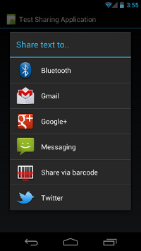

# 向其他应用发送简单的数据
当构建一个 intent 时，必须指定这个 intent 需要触发的 action。Android定义了一些 actions，比如[ACTION_SEND](https://developer.android.google.cn/reference/android/content/Intent.html#ACTION_SEND)，该 action 会指示 intent 用于从一个 activity 发送数据到另外一个 activity，甚至可以是跨进程之间的数据发送。

为了发送数据到另外一个 activity，我们只需要说明数据与数据的类型，系统会自动识别出能够兼容接受这些数据的 activity。如果这些选择有多个，则把这些 activity显示给用户进行选择；如果只有一个，则立即启动该 Activity。同样的，我们可以在 manifest 文件的 Activity 描述中添加接受的数据类型。

在不同的程序之间使用intent收发数据是在社交分享内容时最常用的方法。Intent使用户能够通过最常用的程序进行快速简单的分享信息。

注意:为ActionBar添加分享功能的最佳方法是使用ShareActionProvider，其运行与API level 14以上的系统。ShareActionProvider将在第3课中进行详细介绍。

##分享文本内容

ACTION_SEND 最直接常用的地方是从一个 Activity 发送文本内容到另外一个 Activity。例如，Android内置的浏览器可以将当前显示页面的URL作为文本内容分享到其他程序。这一功能对于通过邮件或者社交网络来分享文章或者网址给好友而言是非常有用的。下面是一段展示分享功能的代码:

```java
Intent sendIntent = new Intent();
sendIntent.setAction(Intent.ACTION_SEND);
sendIntent.putExtra(Intent.EXTRA_TEXT, "This is my text to send.");
sendIntent.setType("text/plain");
startActivity(sendIntent);
```    

如果设备上安装有某个能够匹配ACTION_SEND且MIME类型为text/plain的程序，则Android系统会立即执行它。若有多个匹配的程序，则系统会把他们都给筛选出来，并呈现Dialog给用户进行选择。

如果为intent调用了Intent.createChooser()，那么Android总是会显示可供选择。这样有一些好处：

即使用户之前为这个intent设置了默认的action，选择界面还是会被显示。
如果没有匹配的程序，Android会显示系统信息。
我们可以指定选择界面的标题。
下面是更新后的代码：

```java
Intent sendIntent = new Intent();
sendIntent.setAction(Intent.ACTION_SEND);
sendIntent.putExtra(Intent.EXTRA_TEXT, "This is my text to send.");
sendIntent.setType("text/plain");
startActivity(Intent.createChooser(sendIntent, getResources().getText(R.string.send_to));
```
效果图如下：    



另外,我们可以为 intent设置一些标准的附加值，例如：EXTRA_EMAIL, EXTRA_CC, EXTRA_BCC, EXTRA_SUBJECT等。然而，如果接收程序没有针对那些做特殊的处理，则不会有对应的反应。
>**注：** 一些 e-mail 程序，例如Gmail,对应接收的是 EXTRA_EMAIL 与 EXTRA_CC，他们都是String类型的，可以使用putExtra(string,string[])方法来添加至 intent 中。

##分享二进制内容
分享二进制的数据需要结合设置特定的MIME类型，需要在EXTRA_STREAM`里面放置数据的URI,下面有个分享图片的例子，该例子也可以修改用于分享任何类型的二进制数据：

```java
Intent shareIntent = new Intent();
shareIntent.setAction(Intent.ACTION_SEND);
shareIntent.putExtra(Intent.EXTRA_STREAM, uriToImage);
shareIntent.setType("image/jpeg");
startActivity(Intent.createChooser(shareIntent, getResources().getText(R.string.send_to)));
```
请注意以下内容：

* 我们可以使用  \*/*  这样的方式来指定 MIME 类型，但是这仅仅会匹配到那些能够处理一般数据类型的Activity(即一般的 Activity 无法详尽所有的MIME类型)
 
* 接收的程序需要有访问URI资源的权限。下面有一些方法来处理这个问题：
 
  * 将数据存储在 ContentProvider中，确保其他程序有访问 provider 的权限。较好的提供访问权限的方法是使用 per-URI permissions，其对接收程序而言是只是暂时拥有该许可权限。类似于这样创建ContentProvider的一种简单的方法是使用 FileProvider helper类。
  
  * 使用 MediaStore系统。MediaStore系统主要用于音视频及图片的MIME类型。但在 Android3.0之后，其也可以用于存储非多媒体类型。
  
##发送多个内容
为了同时分享多种不同类型的内容，需要使用 [ACTION_SEND_MULTIPLE](https://developer.android.google.cn/reference/android/content/Intent.html#ACTION_SEND_MULTIPLE) 与指定到那些数据的 URIs列表。MIME 类型也会根据分享的内容结构的不同而有差异。例如，如果分享3张JPEG的图片，那么MIME类型仍然是 "image/jpeg"。如果是不同图片格式的话，应该是用 "image/\*" 来匹配那些可以接收任何图片类型的activity。如果需要分享多种不同类型的数据，可以使用 \*/* 来表示MIME。像前面描述的那样，这取决于那些接收的程序解析并处理我们的数据。下面是一个例子：

```java
ArrayList<Uri> imageUris = new ArrayList<Uri>();
imageUris.add(imageUri1); // Add your image URIs here
imageUris.add(imageUri2);

Intent shareIntent = new Intent();
shareIntent.setAction(Intent.ACTION_SEND_MULTIPLE);
shareIntent.putParcelableArrayListExtra(Intent.EXTRA_STREAM, imageUris);
shareIntent.setType("image/*");
startActivity(Intent.createChooser(shareIntent, "Share images to.."));
```
当然，请确保指定到数据的URIs能够被接收程序所访问(添加访问权限)。