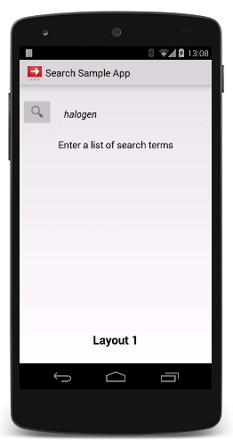
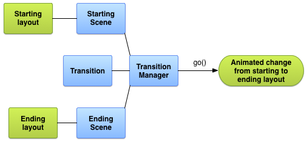

# 过渡动画框架

应用程序的用户界面动画提供更多的不仅仅是视觉上的吸引力。动画明显的变化和提供的视觉提示，都帮助用户了解应用程序是如何工作的。

安卓提供了过渡动画框架 ，帮助你在一个视图层级和另一个视图层级之间完成动画变化。这框架适用于一个或者多个动画在层级结构上的所有视图，框架随它们变化而变化。

这个框架有跟随特性：

组-等级动画

　　适合一个或者多个动画效果在层级结构上的所有视图。

过渡-基础动画

　　运行动画基于开始和结束视图属性值之间的变化。

内置动画

　　包括普通效果的预定义动画，例如淡出和移动。

资源文件支持

　　从布局资源文件加载视图层结构和内置动画。

生命周期回调

　　定义回调以便更好地控制动画在层级的变化过程。

## 概述

这个例子在图1显示出动画是怎么通过提供视觉线索去帮助用户的。过渡动画框架随着应用程序从搜索条目页面到结果页面，它将淡出不再使用的视图，并淡入新的视图。

**图1.** 用户界面动画使用视觉线索

这一个使用过渡动画框架动画的例子，这个框架动画变化在两个层级结构的所有视图。一个层级结构能够更简单的选出视图和更复杂的包含一个详细视图树的[视图组](https://developer.android.google.cn/reference/android/view/ViewGroup.html)，在初始化开始视图层级和最后结束视图层级之间，这个框架赋予每个视图改变一次或者多次属性值。

在视图层级和动画，这个过渡动画框架工作方式是相同的，以储存视图层级状态的目的，更改这些层次结构来修改设备屏幕的外观，且通过存储和应用动画定义来激活更改。

这个图标图2阐明视图层级、框架类和动画之间的关系。

** 图2. **过渡动画框架的关系图

这个过渡动画框架提供抽象的场景、过渡和过渡管理，以下几节描述了这些内容。使用这个框架，你需要在应用程序的视图层级创建场景，以便两者之间进行更改。接下来，你在每个要使用的动画创建一个过渡。在两个视图层级之间开始，你使用一个过渡管理指定这个过渡去使用和结束场景，这个程序描述的细节在这堂课剩下的课程。

## 场景

场景储存了视图层级的状态，包括所有视图和它们的属性值。视图层级能够简化视图，可以复杂视图树和子布局。在场景中存储视图层次结构状态可以使你从另一场景过渡到该状态。这个框架提供的 [场景](https://developer.android.google.cn/reference/android/transition/Scene.html) 可去代表这个场景。

这个过渡动画框架让你通过代码在布局资源文件 和[视图组](https://developer.android.google.cn/reference/android/view/ViewGroup.html) 类创建场景，如果你动态生成一个视图层次结构，或者在运行时修改视图层次结构，那么在代码中创建一个场景是非常有用的。

在多半的情况中，如果你使用过渡，你不能明确的创建一个启动场景。使用框架提供的结束场景作为任何后续过渡的开始场景，如果你不应用过渡，框架会收集有关当前场景状态的视图信息。

在你做出场景改变的时候运行场景,能够同样定义它拥有的活动。举个例子，此功能对过渡到场景后的清理视图设置非常有用。

在添加视图层级和它的属性值，场景还将一个引用存储到视图层次结构的父级。影响场景的场景和动画的更改发生在场景根中。影响场景的场景和动画的更改发生在场景根中。此根视图称为场景根。

去学习怎么去创建场景，看 [创建场景](https://developer.android.google.cn/training/transitions/scenes.html) 。

## 过渡

在这个过渡动画框架，动画创建一系列的帧数，描述开始和结束场景之间的视图层次结构的变化。有关动画的信息存储在一个 [过渡](https://developer.android.google.cn/reference/android/transition/Transition.html) 对象中。要运行动画，你可以使用 [过渡管理器](https://developer.android.google.cn/reference/android/transition/TransitionManager.html) 实例应用过渡。框架可以在两个不同的场景之间过渡，或者过渡到当前场景的不同状态。

该框架包括一组用于常用动画效果的内置过渡，如衰减和调整视图大小。那你还可以定义自己的自定义过渡，以使用动画框架中的API创建动画效果。因为过渡框架使你能够将动画效果组合在包含一组单独的内置或自定义过渡动画中。

这个过渡生命周期类似于活动生命周期，它表示框架在动画开始和完成之间监视的过渡状态。在重要的生命周期状态中，框架调用回调方法，可以在不同阶段的过渡中实现对用户界面的调整。

想学习更多关于过渡，看 [Applying a Transiton](https://developer.android.google.cn/training/transitions/transitions.html) 和 [Create Custom Transitions](https://developer.android.google.cn/training/transitions/custom-transitions.html) .

##局限性

 - 动画适用于 [SurfaceView](https://developer.android.google.cn/reference/android/view/SurfaceView.html) 图形，可能不能正常显示出来。[SurfaceView](https://developer.android.google.cn/reference/android/view/SurfaceView.html) 的实例是从非UI线程更新，所以更新可能会失去与其他视图的动画同步。
 
 - 一些特殊的过渡类型可能不会产生所需的动画效果，在适用于 [TextureView](https://developer.android.google.cn/reference/android/view/TextureView.html) 的时候。
 
 - 扩展的 [AdapterView](https://developer.android.google.cn/reference/android/widget/AdapterView.html) 类，比如 [Listview](https://developer.android.google.cn/reference/android/widget/ListView.html) ,管理他们的孩子视图的方式来与过渡动画框架不符，如果你尝试基于 [AdapterView](https://developer.android.google.cn/reference/android/widget/AdapterView.html) 的动画视图,设备可能会挂掉。
 
 - 如果你尝试在动画时测量大小 [TextView](https://developer.android.google.cn/reference/android/widget/TextView.html) ，在类完全测量大小后，文本将弹一个新位置。若要避免此问题，请不要调整包含文本视图的大小。

>翻译：[@northJjL](https://github.com/northJjL)  
> 审核：[@JackWaiting](https://github.com/JackWaiting)        
>原始文档：<https://developer.android.google.cn/training/transitions/overview.html>