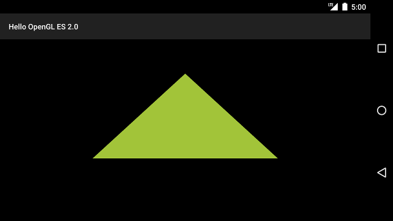

## 绘制Shapes

在你用OpenGL定义绘制图像之后，你可能想要把它们画出来。它提供的api非常好的处理了控制图形和渲染，所以使用OpenGL ES 2.0绘制图形比你想象中还要多一些代码。

本课说明了如何使用OpenGL ES 2.0 API绘制上一堂课定义的图像。

## 初始化图形 

在进行任何绘图之前，你必须初始化并加载你计划要绘制的图形。除非程序中使用的形状结构（原始坐标）在执行过程中发生变化，你应该在您的渲染器的 [onSurfaceCreated()](https://developer.android.google.cn/reference/android/opengl/GLSurfaceView.Renderer.html) 方法初始化它们，以用于内存和处理效率。

	public class MyGLRenderer implements GLSurfaceView.Renderer {
	    ...
	    private Triangle mTriangle;
	    private Square   mSquare;
	
	    public void onSurfaceCreated(GL10 unused, EGLConfig config) {
	        ...
	
	        // initialize a triangle
	        mTriangle = new Triangle();
	        // initialize a square
	        mSquare = new Square();
	    }
	    ...
	}

## 绘制图形

使用OpenGL ES 2.0 绘制一个定义好的图形需要大量的代码，因此你必须提供非常多图形渲染上的细节，具体来说，你必须定义以下内容：

- 顶点着色器- OpenGL ES图形代码渲染顶点的形状。

- 片段着色器- OpenGL ES代码去渲染图形表面上的颜色和纹路。

- 程序 - 一个OpenGL ES对象，它包含了绘制一个或者多个图形的着色器。

你需要至少一个顶点着色器去绘制形状和一个片段着色器来着色给图形，这些着色器必须遵守，然后增加到OpenGL ES的程序中，然后来绘制形状，下面是一个实例，说明如何定义基本着色器，用于Triangle类的绘制形状。

	public class Triangle {
	
	    private final String vertexShaderCode =
	        "attribute vec4 vPosition;" +
	        "void main() {" +
	        "  gl_Position = vPosition;" +
	        "}";
	
	    private final String fragmentShaderCode =
	        "precision mediump float;" +
	        "uniform vec4 vColor;" +
	        "void main() {" +
	        "  gl_FragColor = vColor;" +
	        "}";
	
	    ...
	}

着色器包含OpenGL的着色语言（GLSL）代码，它必须被编译使用在OpenGL ES的环境之前。在编译该代码时，创建渲染器类的实用方法。

	public static int loadShader(int type, String shaderCode){
	
	    // create a vertex shader type (GLES20.GL_VERTEX_SHADER)
	    // or a fragment shader type (GLES20.GL_FRAGMENT_SHADER)
	    int shader = GLES20.glCreateShader(type);
	
	    // add the source code to the shader and compile it
	    GLES20.glShaderSource(shader, shaderCode);
	    GLES20.glCompileShader(shader);
	
	    return shader;
	}

为了绘制你要的形状，你必须编译该着色器代码，在你的绘制类完成构造函数时，添加它们到OpenGL ES程序类和程序链接，它只会完成了一次。

>注意: 编译OpenGL ES着色器和链接程序在CPU周期和处理时间上是很昂贵的。因此你应该避免多次操作。如果运行时不知道着色器内容，你应该构建你的代码，这样他们只需创建一次，然后缓存以后使用。

	public class Triangle() {
	    ...
	
	    private final int mProgram;
	
	    public Triangle() {
	        ...
	
	        int vertexShader = MyGLRenderer.loadShader(GLES20.GL_VERTEX_SHADER,
	                                        vertexShaderCode);
	        int fragmentShader = MyGLRenderer.loadShader(GLES20.GL_FRAGMENT_SHADER,
	                                        fragmentShaderCode);
	
	        // create empty OpenGL ES Program
	        mProgram = GLES20.glCreateProgram();
	
	        // add the vertex shader to program
	        GLES20.glAttachShader(mProgram, vertexShader);
	
	        // add the fragment shader to program
	        GLES20.glAttachShader(mProgram, fragmentShader);
	
	        // creates OpenGL ES program executables
	        GLES20.glLinkProgram(mProgram);
	    }
	}

此时此刻，你该准备添加绘制图形的实际调用了，使用OpenGL ES的绘制图形需要指定几个参数。告诉渲染渠道你想要绘制什么以及如何绘制它。由于绘制选择能根据形状而变化，所以让你的形状类包含自己的绘制逻辑是一个好主意。

创建绘制图形的draw()方法，这代码将位置和颜色值设置为图形的顶点着色器以及片段着色器，然后执行绘制功能。

	private int mPositionHandle;
	private int mColorHandle;
	
	private final int vertexCount = triangleCoords.length / COORDS_PER_VERTEX;
	private final int vertexStride = COORDS_PER_VERTEX * 4; // 4 bytes per vertex
	
	public void draw() {
	    // Add program to OpenGL ES environment
	    GLES20.glUseProgram(mProgram);
	
	    // get handle to vertex shader's vPosition member
	    mPositionHandle = GLES20.glGetAttribLocation(mProgram, "vPosition");
	
	    // Enable a handle to the triangle vertices
	    GLES20.glEnableVertexAttribArray(mPositionHandle);
	
	    // Prepare the triangle coordinate data
	    GLES20.glVertexAttribPointer(mPositionHandle, COORDS_PER_VERTEX,
	                                 GLES20.GL_FLOAT, false,
	                                 vertexStride, vertexBuffer);
	
	    // get handle to fragment shader's vColor member
	    mColorHandle = GLES20.glGetUniformLocation(mProgram, "vColor");
	
	    // Set color for drawing the triangle
	    GLES20.glUniform4fv(mColorHandle, 1, color, 0);
	
	    // Draw the triangle
	    GLES20.glDrawArrays(GLES20.GL_TRIANGLES, 0, vertexCount);
	
	    // Disable vertex array
	    GLES20.glDisableVertexAttribArray(mPositionHandle);
	}
	Once you have all this code in place, drawing this object just requires a call to the draw() method from within your renderer’s onDrawFrame() method:
	
	public void onDrawFrame(GL10 unused) {
	    ...
	
	    mTriangle.draw();
	}

一旦你拥有了这些代码，绘制该对象仅仅需要从你渲染器的[onDrawFrame()](https://developer.android.google.cn/reference/android/opengl/GLSurfaceView.Renderer.html)方法内调用draw方法。

	public void onDrawFrame(GL10 unused) {
	    ...
	
	    mTriangle.draw();
	}

在你跑应用程序的时候，应该看起来像这样:

 

**图1** 没有投射或照相视图绘制的三角形。

这个代码实例有一些问题，首先，它不会给你的朋友带来深刻的印象，其次，在你改设备的屏幕方向的时候，这个三角形会被压扁，改变形状。图形倾斜的实际原因是由于类对象顶点没有得到屏幕区域修正到正常比例显示[GLSurfaceView](https://developer.android.google.cn/reference/android/opengl/GLSurfaceView.html)。在下一堂课中，可以使用投射和相机视图修复他们。

<<<<<<< HEAD
>翻译：[@northJjL](https://github.com/northJjL)                                
>审核：[@JackWaiting](https://github.com/JackWaiting)       
原始文档：<https://developer.android.google.cn/training/graphics/opengl/draw.html#draw>
=======
最后，这三角形是静止的，有点无聊，在[添加动作](https://developer.android.google.cn/training/graphics/opengl/motion.html)课堂时，让这个形状旋转，使OpenGL ES图像渠道更加有趣。
>>>>>>> 22d235b2285cf7b2d6afcfbccd33b1dde038986c

>翻译：[@northJjL](https://github.com/northJjL)      
> 审核：       
原始文档：<https://developer.android.google.cn/training/graphics/opengl/draw.html#draw>
