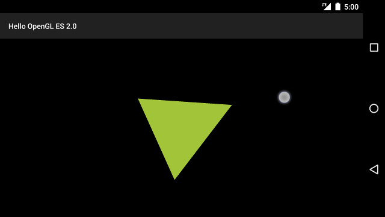

# 响应触摸事件

让一个对象根据预设的程序进行移动，比如让三角形旋转，看起来很吸引眼球。但是怎么才能让用户和OpenGL ES 图形进行交互？关键就在于扩展 [GLSurfaceView](https://developer.android.google.cn/reference/android/opengl/GLSurfaceView.html) 的实现，重写 [onTouchEvent()](https://developer.android.google.cn/reference/android/view/View.html#onTouchEvent(android.view.MotionEvent)) 来监听处理用户触摸事件。

这节课讲解如何根据监听触摸事件来旋转 OpenGL ES 图形对象。

## 设置触摸监听器

为了让 OpenGL ES 应用响应触摸事件，需要实现在 [GLSurfaceView](https://developer.android.google.cn/reference/android/opengl/GLSurfaceView.html) 类中的 [onTouchEvent()](https://developer.android.google.cn/reference/android/view/View.html#onTouchEvent(android.view.MotionEvent)) 方法。下面简单的实现展示了怎样去监听 [MotionEvent.ACTION_MOVE](https://developer.android.google.cn/reference/android/view/MotionEvent.html#ACTION_MOVE) 事件并将之转换为形状旋转的角度。

```java
private final float TOUCH_SCALE_FACTOR = 180.0f / 320;
private float mPreviousX;
private float mPreviousY;

@Override
public boolean onTouchEvent(MotionEvent e) {
    // MotionEvent reports input details from the touch screen
    // and other input controls. In this case, you are only
    // interested in events where the touch position changed.

    float x = e.getX();
    float y = e.getY();

    switch (e.getAction()) {
        case MotionEvent.ACTION_MOVE:

            float dx = x - mPreviousX;
            float dy = y - mPreviousY;

            // reverse direction of rotation above the mid-line
            if (y > getHeight() / 2) {
              dx = dx * -1 ;
            }

            // reverse direction of rotation to left of the mid-line
            if (x < getWidth() / 2) {
              dy = dy * -1 ;
            }

            mRenderer.setAngle(
                    mRenderer.getAngle() +
                    ((dx + dy) * TOUCH_SCALE_FACTOR));
            requestRender();
    }

    mPreviousX = x;
    mPreviousY = y;
    return true;
}
```
需要注意的是，在计算一个旋转的角度后，都将调用一次 [requestRender()](https://developer.android.google.cn/reference/android/opengl/GLSurfaceView.html#requestRender()) 方法来告诉渲染器需要进行绘制了。这是最高效的方法，因为如果没有发生旋转改变，是不需要重绘的。当然，当数据发生改变时需要使用 [setRenderMode()](https://developer.android.google.cn/reference/android/opengl/GLSurfaceView.html#setRenderMode(int)) 方法，以保证渲染器在重绘时的效率不受影响，所以请确保没有注释这行代码：

```java
public MyGLSurfaceView(Context context) {
    ...
    // Render the view only when there is a change in the drawing data
    setRenderMode(GLSurfaceView.RENDERMODE_WHEN_DIRTY);
}

```
## 传递旋转角度 

上面的代码还需要我们在渲染的过程中添加一个 public 成员变量，用来展示旋转角度。因为渲染器代码运行在一个独立线程中，而不是 UI 线程。所以需要声明这个公共变量为 *volatile*。下面是代码示例，包括了此变量的声明以及对应的set和get方法。


```java
public class MyGLRenderer implements GLSurfaceView.Renderer {
    ...

    public volatile float mAngle;

    public float getAngle() {
        return mAngle;
    }

    public void setAngle(float angle) {
        mAngle = angle;
    }
}

```
## 旋转

触摸产生的旋转，添加以下代码
为了使触摸输入产生的旋转生效，需要注释掉创建图形旋转角度的代码并添加*mAngle* 变量，该变量为触摸输入所产生的角度：

```java
public void onDrawFrame(GL10 gl) {
    ...
    float[] scratch = new float[16];

    // Create a rotation for the triangle
    // long time = SystemClock.uptimeMillis() % 4000L;
    // float angle = 0.090f * ((int) time);
    Matrix.setRotateM(mRotationMatrix, 0, mAngle, 0, 0, -1.0f);

    // Combine the rotation matrix with the projection and camera view
    // Note that the mMVPMatrix factor *must be first* in order
    // for the matrix multiplication product to be correct.
    Matrix.multiplyMM(scratch, 0, mMVPMatrix, 0, mRotationMatrix, 0);

    // Draw triangle
    mTriangle.draw(scratch);
}
```
完成以上步骤之后，运行程序，然后可以通过手指滑动屏幕来改变三角形的角度。


图 1. 三角形随着触摸屏幕的手指滑动而旋转(圆点为当前触摸位置).

>翻译：[@misparking](https://github.com/misparking)    
> 审核：[@iOnesmile](https://github.com/iOnesmile)      
原始文档：<https://developer.android.google.cn/training/graphics/opengl/touch.html>
