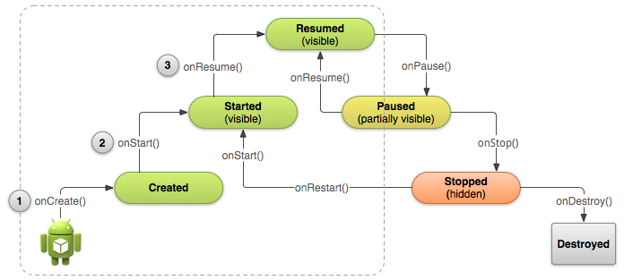

#
#启动 Activity

不同于使用 main() 方法启动应用的其他编程范例，Android 系统会通过调用对应于其生命周期中特定阶段的特定回调方法在 Activity 实例中启动代码。有一系列可启动 Activity 的回调方法，以及一系列可分解 Activity 的回调方法。

本课程概述了最重要的生命周期方法，并向您展示如何处理创建 Activity 新实例的第一个生命周期回调

##了解生命周期回调
***

在 Activity 的生命周期中，系统会按类似于阶梯金字塔的顺序调用一组核心的生命周期方法。 也就是说，Activity 生命周期的每个阶段就是金字塔上的一阶。 当系统创建新 Activity 实例时，每个回调方法会将 Activity 状态向顶端移动一阶。 金字塔的顶端是 Activity 在前台运行并且用户可以与其交互的时间点。

当用户开始离开 Activity 时，系统会调用其他方法在金字塔中将 Activity 状态下移，从而销毁 Activity。 在有些情况下，Activity 将只在金字塔中部分下移并等待（比如，当用户切换到其他应用时），Activity 可从该点开始移回顶端（如果用户返回到该 Activity），并在用户停止的位置继续。


图 1. 简化的 Activity 生命周期图示，以阶梯金字塔表示。此图示显示，对于用于将 Activity 朝顶端的“继续”状态移动一阶的每个回调，有一种将 Activity 下移一阶的回调方法。 Activity 还可以从“暂停”和“停止”状态回到继续状态。

根据 Activity 的复杂程度，您可能不需要实现所有生命周期方法。 但是，了解每个方法并实现确保您的应用按照用户期望的方式运行的方法非常重要。 正确实现您的 Activity 生命周期方法可确保您的应用按照以下几种方式良好运行，包括：

- 如果用户在使用您的应用时接听来电或切换到另一个应用，它不会崩溃。

- 在用户未主动使用它时不会消耗宝贵的系统资源。

- 如果用户离开您的应用并稍后返回，不会丢失用户的进度。

- 当屏幕在横向和纵向之间旋转时，不会崩溃或丢失用户的进度。

正如您将要在以下课程中要学习的，存在 Activity 会在图 1 所示不同状态之间过渡的几种情况。但是，这些状态中只有三种可以是静态。也就是说，Activity 只能在三种状态之一下存在很长时间。

继续

    在这种状态下，Activity 处于前台，且用户可以与其交互。（有时也称为“运行”状态。）
暂停

    在这种状态下，Activity 被在前台中处于半透明状态或者未覆盖整个屏幕的另一个 Activity—部分阻挡。 暂停的 Activity 不会接收用户输入并且无法执行任何代码。
停止

    在这种状态下，Activity 被完全隐藏并且对用户不可见；它被视为处于后台。 停止时，Activity 实例及其诸如成员变量等所有状态信息将保留，但它无法执行任何代码。
其他状态（“创建”和“开始”）是瞬态，系统会通过调用下一个生命周期回调方法从这些状态快速移到下一个状态。 也就是说，在系统调用 onCreate() 之后，它会快速调用 onStart()，紧接着快速调用 onResume()。

基本 Activity 生命周期部分到此为止。现在，您将开始学习特定生命周期行为的一些知识。

##指定您的应用的启动器 Activity
当用户从主屏幕选择您的应用图标时，系统会为您已声明为“启动器”（或“主要”）Activity 的应用中的 Activity 调用 onCreate() 方法。这是作为 您的应用的用户界面主入口的 Activity。

您可以在 Android 清单文件 AndroidManifest.xml 中定义哪个 Activity 用作主 Activity，该文件位于您项目目录的根目录中。

您的应用的主 Activity 必须使用 <intent-filter>（包括 MAIN 操作和 LAUNCHER 类别）在清单文件中声明。例如：
```xml
<activity android:name=".MainActivity" android:label="@string/app_name">
    <intent-filter>
        <action android:name="android.intent.action.MAIN" />
        <category android:name="android.intent.category.LAUNCHER" />
    </intent-filter>
</activity>
```
>**注**: 当您使用 Android SDK工具创建新 Android 项目时，默认的项目文件包括使用过滤器在宣示说明中声明的 Activity 类。

如果未对您的 Activity 之一声明 MAIN 操作或 LAUNCHER 类别，那么您的应用图标将不会出现在应用的主屏幕列表中。

创建一个新实例
大多数应用包含若干个不同的 Activity，用户可通过这些 Activity 执行不同的操作。无论 Activity 是用户单击您的应用图标时创建的主 Activity 还是您的应用在响应用户操作时开始的其他 Activity，系统都会通过调用其 onCreate() 方法创建 Activity 的每个新实例。

您必须实现 onCreate() 方法执行只应在 Activity 整个生命周期出现一次的基本应用启动逻辑。 例如，您的 onCreate() 的实现应定义用户界面并且可能实例化某些类范围变量。

例如，onCreate() 方法的以下示例显示执行 Activity 某些基本设置的一些代码，比如声明用户界面（在 XML 布局文件中定义）、定义成员变量，以及配置某些 UI。
```java
TextView mTextView; // Member variable for text view in the layout

@Override
public void onCreate(Bundle savedInstanceState) {
    super.onCreate(savedInstanceState);

    // Set the user interface layout for this Activity
    // The layout file is defined in the project res/layout/main_activity.xml file
    setContentView(R.layout.main_activity);

    // Initialize member TextView so we can manipulate it later
    mTextView = (TextView) findViewById(R.id.text_message);

    // Make sure we're running on Honeycomb or higher to use ActionBar APIs
    if (Build.VERSION.SDK_INT >= Build.VERSION_CODES.HONEYCOMB) {
        // For the main activity, make sure the app icon in the action bar
        // does not behave as a button
        ActionBar actionBar = getActionBar();
        actionBar.setHomeButtonEnabled(false);
    }
}
```
>**注意**: 使用 SDK_INT 可防止旧版系统以这种方式仅在 Android 2.0 （API 级别5）和更高级别执行新 API 工作。 较旧版本会遇到运行时异常。

一旦 onCreate() 完成执行操作，系统会相继调用 onStart() 和 onResume() 方法。 您的 Activity 从不会驻留在“已创建”或“已开始”状态。在技术上，Activity 会在 onStart() 被调用时变得可见，但紧接着是 onResume()，且 Activity 保持“继续”状态，直到有事情发生使其发生变化，比如当接听来电时，用户导航至另一个 Activity，或设备屏幕关闭。

在接下来的其他课程中，您将看到其他启动方法（onStart() 和 onResume()）在用于从“暂停”或“停止”状态继续 Activity 时如何在您的 Activity 生命周期中发挥作用。

>**注**: onCreate() 方法包括一个称为 savedInstanceState 的参数，将在有关重新创建 Activity的后续课程中讨论该参数。



图 2. Activity 生命周期结构的另一个图示，其重点放在创建 Activity 的新实例时系统依次调用的三大回调上:onCreate()、onStart() 和 onResume()。 一旦这一系列回调完成，Activity 就进入“继续”状态，此时用户可与 Activity 进行交互，直至用户切换到其他 Activity。

销毁 Activity
当 Activity 的第一个生命周期回调是 onCreate() 时，它最近的回调是 onDestroy()。系统会对您的 Activity 调用此方法，作为您的 Activity 实例完全从系统内存移除的最终信号。

大多数应用不需要实现此方法，因为局部类引用与 Activity 一同销毁，并且您的 Activity 应在 onPause() 和 onStop() 期间执行大多数清理操作。但是，如果您的 Activity 包含您在 onCreate() 期间创建的后台线程或其他如若未正确关闭可能导致内存泄露的长期运行资源，您应在 onDestroy() 期间终止它们。

```java 
@Override
public void onDestroy() {
    super.onDestroy();  // Always call the superclass

    // Stop method tracing that the activity started during onCreate()
    android.os.Debug.stopMethodTracing();
}
```
>**注**: 在所有情况下，系统在调用 onPause() 和 onStop() 之后都会调用 onDestroy()，只有一个例外：当您从 onCreate() 方法内调用 finish() 时。在某些情况下，比如当您的 Activity 作为临时决策工具运行以启动另一个 Activity 时，您可从 onCreate() 内调用 finish() 来销毁 Activity。在这种情况下，系统会立刻调用 onDestroy()，而不调用任何其他 生命周期方法。
