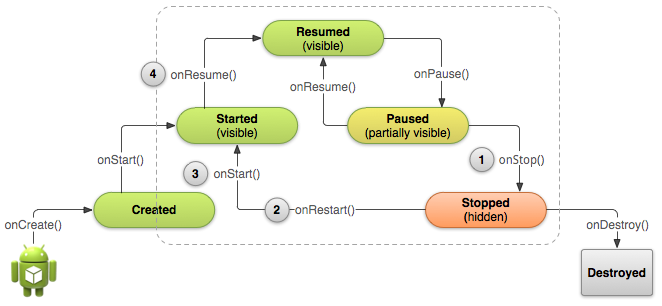

##停止和重启 Activity

正确停止和重启 Activity 是 Activity 生命周期中的重要过程，其可确保你的用户知晓应用始终保持活跃状态并且不会丢失进度。Activity 停止和重启的场景主要有以下几种：

* 用户打开“最近应用”窗口并从你的应用切换到另一个应用。你的应用中当前位于前台的 Activity 将停止。 如果用户从主屏幕启动器图标或“最近应用”窗口返回到你的应用，将会重启 Activity。

* 用户在你的应用中执行开始新 Activity 的操作。当第二个 Activity 创建好后，当前 Activity 便停止。 如果用户之后按了返回按钮，第一个 Activity 会重新开始。

* 用户在其手机上使用你的应用的同时接听来电。

[Activity](https://developer.android.google.cn/reference/android/app/Activity.html) 类提供两种生命周期方法： [onStop()](https://developer.android.google.cn/reference/android/app/Activity.html#onStop()) 和 [onRestart()](https://developer.android.google.cn/reference/android/app/Activity.html#onRestart())，这些方法允许你专门处理 Activity 句柄停止和重新启动的方式。 不同于识别部分 UI 阻挡的暂停状态，停止状态保证 UI 不再可见，且用户的焦点在另外的 Activity（或完全独立的应用）中。

>**注**：因为系统在 [Activity](https://developer.android.google.cn/reference/android/app/Activity.html) 停止时会将你的 Activity 实例保留在系统内存中，你根本无需实现 [onStop()](https://developer.android.google.cn/reference/android/app/Activity.html#onStop()) 和 [onRestart()](https://developer.android.google.cn/reference/android/app/Activity.html#onRestart()) 或甚至 [onStart()](https://developer.android.google.cn/reference/android/app/Activity.html#onStart()) 方法。对于大多数相对简单的 Activity 而言，Activity 将停止并重新启动，并且你可能只需使用 [onPause()](https://developer.android.google.cn/reference/android/app/Activity.html#onPause()) 暂停正在进行的操作，并从系统资源断开连接。

图 1. 用户离开 Activity 时，系统会调用 [onStop()](https://developer.android.google.cn/reference/android/app/Activity.html#onStop()) 停止 Activity (1)。如果用户在 Activity 停止时返回，系统会调用 [onRestart()](https://developer.android.google.cn/reference/android/app/Activity.html#onRestart()) (2)，紧接着调用 [onStart()](https://developer.android.google.cn/reference/android/app/Activity.html#onStart()) (3) 和 [onResume()](https://developer.android.google.cn/reference/android/app/Activity.html#onResume()) (4)。请注意，无论什么场景导致 Activity 停止，系统始终会在调用 [onStop()](https://developer.android.google.cn/reference/android/app/Activity.html#onStop()) 之前调用 [onPause()](https://developer.android.google.cn/reference/android/app/Activity.html#onPause())。

##停止 Activity

当你的 Activity 收到 onStop() 方法的调用时，它不再可见，并且应释放几乎所有用户不使用时不需要的资源。 一旦你的 Activity 停止，如果需要恢复系统内存，系统可能会销毁该实例。 在极端情况下，系统可能会仅终止应用进程，而不会调用 Activity 的最终 [onDestroy()](https://developer.android.google.cn/reference/android/app/Activity.html#onDestroy()) 回调，因此你使用 onStop() 释放可能泄露内存的资源非常重要。

尽管 onPause() 方法在 onStop()之前调用，你应使用 onStop() 执行更大、占用更多 CPU 的关闭操作，比如向数据库写入信息。

例如，此处是将草稿笔记内容保存在永久存储中的 onStop() 的实现：

	@Override
	protected void onStop() {
    	super.onStop();  // Always call the superclass method first

    	// Save the note's current draft, because the activity is stopping
    	// and we want to be sure the current note progress isn't lost.
    	ContentValues values = new ContentValues();
    	values.put(NotePad.Notes.COLUMN_NAME_NOTE, getCurrentNoteText());
    	values.put(NotePad.Notes.COLUMN_NAME_TITLE, getCurrentNoteTitle());

    	getContentResolver().update(
            mUri,    // The URI for the note to update.
            values,  // The map of column names and new values to apply to them.
            null,    // No SELECT criteria are used.
            null     // No WHERE columns are used.
            );
	}

当你的 Activity 停止时， Activity 对象将驻留在内存中并在 Activity 继续时被再次调用。 你无需重新初始化在任何导致进入“继续”状态的回调方法过程中创建的组件。 系统还会在布局中跟踪每个 [View](https://developer.android.google.cn/reference/android/view/View.html) 的当前状态，如果用户在 [EditText](https://developer.android.google.cn/reference/android/widget/EditText.html) 小部件中输入文本，该内容会保留，因此你无需保存即可恢复它。

>**注**：即使系统在 Activity 停止时销毁了 Activity，它仍会保留 [Bundle](https://developer.android.google.cn/reference/android/os/Bundle.html)（键值对的二进制大对象）中的 View 对象（比如 EditText 中的文本），并在用户导航回 Activity 的相同实例时恢复它们（[下一堂](https://developer.android.google.cn/training/basics/activity-lifecycle/recreating.html)课讲述更多有关在你的 Activity 被销毁且重新创建的情况下使用 Bundle 保存其他数据状态的知识）。

##启动/重启 Activity

当你的 Activity 从停止状态返回前台时，它会接收对 onRestart() 的调用。系统还会在每次你的 Activity 变为可见时调用 onStart() 方法（无论是正重新开始还是初次创建）。但是，只会在 Activity 从停止状态继续时调用 onRestart() 方法，因此你可以使用它执行只有在 Activity 之前停止但未销毁的情况下可能必须执行的特殊恢复工作。

应用需要使用 onRestart() 恢复 Activity 状态的情况并不常见，因此没有适用于一般应用群体的任何方法指导原则。 但是，因为你的 onStop() 方法应基本清理所有 Activity 的资源，你将需要在 Activity 重新开始时重新实例化它们。 但是，你还需要在你的 Activity 初次创建时重新实例化它们（没有 Activity 的现有实例）。 出于此原因，你应经常使用 onStart() 回调方法作为 onStop() 方法的对应部分，因为系统会在它创建你的 Activity 以及从停止状态重新启动 Activity 时调用 onStart()。

例如，因为用户可能在回到它之前已离开应用很长时间，onStart() 方法是验证所需系统功能是否已启用的理想选择：

	@Override
	protected void onStart() {
	    super.onStart();  // Always call the superclass method first
	
	    // The activity is either being restarted or started for the first time
	    // so this is where we should make sure that GPS is enabled
	    LocationManager locationManager =
	            (LocationManager) getSystemService(Context.LOCATION_SERVICE);
	    boolean gpsEnabled = locationManager.isProviderEnabled(LocationManager.GPS_PROVIDER);
	
	    if (!gpsEnabled) {
	        // Create a dialog here that requests the user to enable GPS, and use an intent
	        // with the android.provider.Settings.ACTION_LOCATION_SOURCE_SETTINGS action
	        // to take the user to the Settings screen to enable GPS when they click "OK"
	    }
	}
	
	@Override
	protected void onRestart() {
	    super.onRestart();  // Always call the superclass method first
	
	    // Activity being restarted from stopped state
	}

当系统销毁你的 Activity 时，它会调用你的 Activity 的 onDestroy() 方法。因为你通常应已使用 onStop() 释放大多数你的资源，到你接收对 onDestroy() 的调用时，大多数应用无需做太多操作。此方法是你清理可导致内存泄露的资源的最后一种方法，因此你应确保其他线程被销毁且其他长期运行的操作（比如方法跟踪）也会停止。

>**备注:**  
翻译 ：[@jarylan](https://github.com/jarylan)  
原始文档:[https://developer.android.com/training/basics/activity-lifecycle/stopping.html#Start](https://developer.android.com/training/basics/activity-lifecycle/stopping.html#Start)
